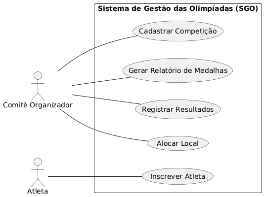
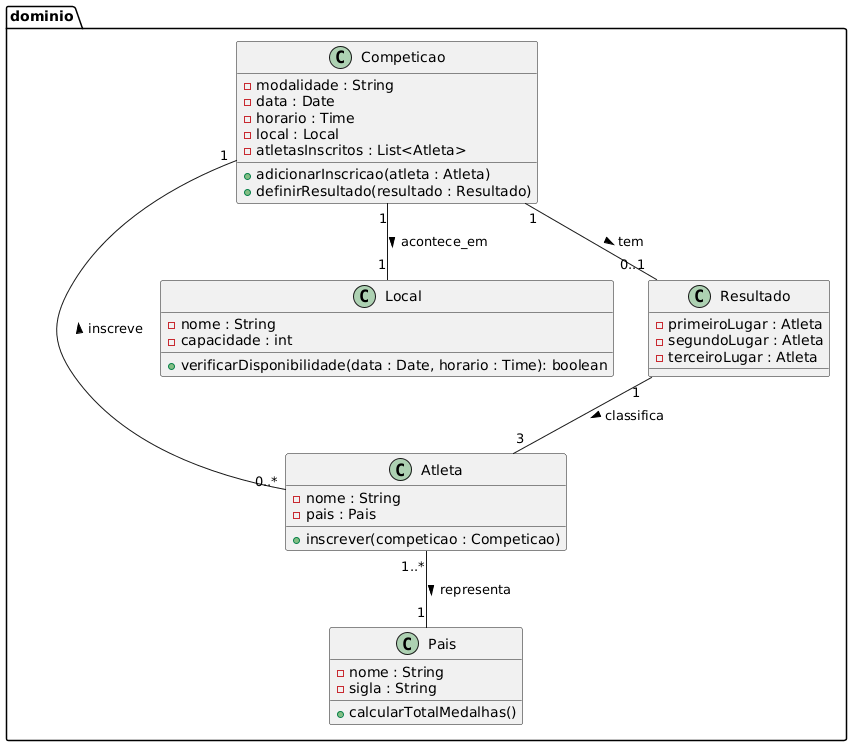
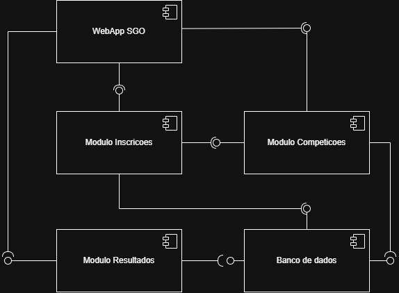
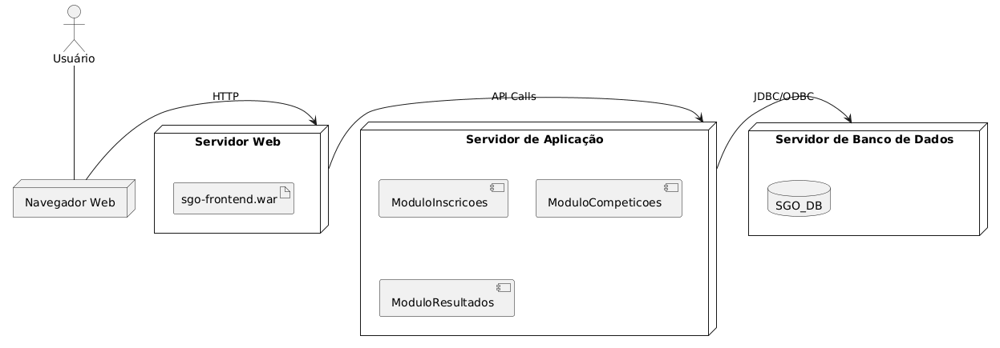

# Sistema de Gestão das Olimpíadas (SGO)

Este repositório contém a modelagem UML para o Sistema de Gestão das Olimpíadas (SGO), desenvolvido como parte da disciplina de Projeto de Software. O sistema visa gerenciar competições, inscrições de atletas, alocação de locais e controle de resultados para o evento.

## Histórias de Usuário

* **US01:** Como um **Comitê Organizador**, eu quero **cadastrar uma nova competição** com modalidade, data, horário e local, para que os atletas possam se inscrever nela.
* **US02:** Como um **Atleta**, eu quero **me inscrever em uma competição** disponível na minha modalidade, para que eu possa participar do evento.
* **US03:** Como um **Comitê Organizador**, eu quero **alocar um local** para uma competição, garantindo que não haja conflitos de horário com outras competições no mesmo local.
* **US04:** Como um **Comitê Organizador**, eu quero **registrar os resultados** de uma competição finalizada, definindo os três primeiros colocados (ouro, prata, bronze), para que as medalhas possam ser contabilizadas.
* **US05:** Como um **Comitê Organizador**, eu quero **gerar um relatório de medalhas** por país, exibindo o total de medalhas de ouro, prata e bronze, para que eu possa acompanhar o desempenho de cada nação.

## Modelagem UML

A seguir são apresentados os diagramas UML desenvolvidos para o sistema SGO.

### Diagrama de Caso de Uso
 

### Diagrama de Classes
 

### Diagrama de Componentes
 

### Diagrama de Implantação

